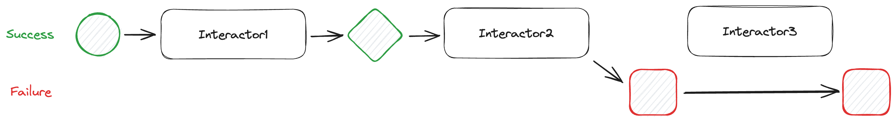

> [!TIP]
>
> If you're looking for a TOC, GitHub generates it for you: should find it
> clicking some icons on the right side of this readme

# What's up?

All started with a question: is *Interactor* worth to have as a dependency in
a project?

I'll try to chat about:

- what is an interactor?
- is an interactor better than a PORO?
- does an interactor materialize business logic?
- is an interactor OO? Is it functional?
- what *Interactor* lacks? Could we enrich it?

The gem in this repo will serve as practical demonstrator of the subjects.
We'll use it to add some additional bricks to a basic interactor and to test
a conceptually different approach. And we'll see how hard could be to implement
a custom - rough and basic - solution by having the source code at hand.

# What is an interactor?

> [!NOTE]
> "Interactor", "service object" and "action" are considered synonyms in this
> text. It's not by correctness, but for simplicity sake. Discussing about
> eventual differences is not the point here.
>
> "Organizer", "orchestrator" are considered synonyms.
>
> "Compose" is used generically and not always in the most correct sense.

We'll start this journey taking *Interactor* gem as comparison and starting
point. This is a discussion about software design and micro-architecture,
not about the value of the gem. It's not a rant, just a comment about the
solution *Interactor* represents.
*Interactor* has its place and his story. And its authors and contributors
deserve all the thanks.

A quote from https://github.com/collectiveidea/interactor#what-is-an-interactor

> An interactor is a simple, single-purpose object.
>
> Interactors are used to encapsulate your application's [business logic](http://en.wikipedia.org/wiki/Business_logic).
> Each interactor represents one thing that your application *does*.

I have a lot of opinions and notes about such an assertion.

Given this description:

> An interactor is a simple, single-purpose object.

this should be the simplest implementation

```ruby
class Orders::UserNotification
  def notify_shipment(order, user)
    # ...
  end
end
```

If that's enough for you: well done. You don't need a gem, a library, a pattern.
You're writing in an object oriented language and all you need is an object.
Lucky you!

## «Everything the application does»

>  a glance at that directory [app/interactors, *ndr*] gives any developer a
> quick understanding of everything the application *does*.

That's not understanding.

*Walk*, *eat*, *poop* doesn't make you understand it's a cat.

Who «does»? When does it «do»? Why it «do» that thing? In which **order**?

#  All you need is an object!

Unfortunately in many teams and scenarios **it's really hard to write an
object**! Let's imagine: you're working with a team on a complex Rails project.
The team sticks to the *rails way* 100%. Where you'll add your object? Will you
open a discussion sustaining that `Orders::UserNotification` should be a *model*?
Do you have the time/position to propose to create a new subdirectory beneath
`app/models`? Let's admit: in a standard scenario you're on a Rails app where
the only business layer are models (and Rails models are a mixture - no negative
suppositions - of entities and business logic).

Service objects have gained enough popularity to justify a new 3rd party
requiring a new folder beneath `app/`; and moreover it's not a
design/organization decision that weighs on your shoulders.

My take is:

- gems like collectiveidea/interactor bring few small advantages to the project
- maybe the cost of the dependency is not worth
- developers in a Rails project often feel afraid of autonomously structuring
  the domain layer: the feeling of abandoning the *rails way*, breaking the
  conventional structure, could be overwhelming and inhibiting
- here come the cost worth to pay: the 3rd party you use is making choices that
  you and your team won't have to take. It's faster to convey on the use of a
  gem than on the addition of a custom folder beneath `app/`!

Do we need new tools because they're the right ones to solve our problems or
we're just in search of an already consolidated convention? It's engineering or
instinct?

Back on practical things, we have installed interactor and now we have to deal
with *new, strange* objects somewhat resembling functions...

# Objects resembling functions

## Enforcing the single-purpose

We want to implement a single-purpose object, but once our kiddo is in the wild
it will be extended. That's the nature of an object, but we want to preserve it.

It's too easy to extend an object with new behavior:

```ruby
class Orders::UserNotification
  def notify_shipment(order, user) = # ...

  def notify_delay(order, user) = # Not single-purpose anymore
end
```

We'll close its interface making it a "callable" thing

```ruby
class Orders::UserNotification
  def call(order, user) = # ...

  private

  def a_bunch_of_methods = # ...
end
```

## Enforcing _being an action_

Since we're mimicking a function, we feel the urgency to express it as a
function, thus naming it with a verb or any other grammar construct representing
the *doing only one thing*.

```ruby
class Orders::NotifyShipment
  def call(order, user) = # ...
end
```

Now it's hard to think to add new public methods to this object: we narrowed
its scope too much.

Let me repeat myself, this *verb* alone does not represent business logic. This
is just a backend operation. This thing alone doesn't tell us anything about
what the system does in business terms.

With the interactor gem this would look like

```ruby
# interactors/notify_shipment.rb
class NotifyShipment
  include Interactor

  def call(order, user) = # ...
end
```

At least we have a conventional place where to put something that our system
does...

## Accomplishments

The decision to use service objects in a project brings some accomplishments.
This can be evident introducing them in a pre-existent project where tons of
logic were liquefied in a myriad of unreachable corners of the code base
without any type of organization nor concept materialization.

- we've written a piece of logic in a conventional place
- it is discoverable
- it is callable
- we named the thing
- we named the thing
- we named the thing (ok ok, got it)
- we know this logic could be called from many places
- we start to understand if this logic is a sub-unit of something greater
- writing the logic we understand if it's a logic that could fail.

# Organising sparse actions

Alias: making sense of the chaos you created.

Unless you're just offloading single-purpose micro-units of logic from a
controller, you'll find that single interactors will be useful when composed
together.

Let's introduce organizers: the device demonstrating you understood nothing
about the system or about business workflows just by knowing all the sparse
actions the system can play.

You tried so hard to make those things single-purpose, but sending an email does
not represent a business workflow in your system. It's just the tail of the cat.
And now you need to describe the cat.

When you compose (or organize or orchestrate) single-purpose-standalone-micro-unit
of logic you face new challenges:

- naming the resulting thing as a whole
- using a Local DTO; *the whole* needs a state shared among sub-units.

This Local DTO is often called *the context*.

> [!NOTE]
>
> *Local DTO* is often considered an anti-pattern by a lot of OO designers.
> It's not my intention to discuss the matter. I just observe the fact that this
> pattern is used in a number of libraries implementing organized service objects.

# The central role of the context

When you compose interactors together, you shift your attention from "what a
single interactor does" to "what a single interactor needs to do what it does".

By this shift you loose quite a lot of the simplicity you found when reading and
writing a single interactor. You can no more think of your interactor as it's
completely isolated and you have to manage all the data flowing across
interactors and how data is mutated by them.

This is an example using interactor gem:

```ruby
# interactors/eat.rb
class Eat
  include Interactor

  def call
    context.fail!(message: :no) if hungry?

    context.eaten << context.food
  end

  private

  private def hungry? = context.eaten.empty?
end

# interactors/walk.rb
class Walk
  include Interactor

  def call
    context.fail!(message: :no) if hungry?

    context.walked = true
    context.eaten.shift
  end

  private

  private def hungry? = context.eaten.empty?
end

# interactors/poop.rb
class Poop
  include Interactor

  def call
    context.fail!(message: :no) unless sated?

    context.eaten.replace []
    puts "Meow"
  end

  private

  private def sated? = context.eaten.size >= 2
end

# organizers/let_the_cat_live.rb
class LetTheCatLive
  include Interactor::Organizer

  organize Eat, Walk, Poop
end

outcome = LetTheCatLive.call(food: 'fish', eaten: [])
outcome.success? #=> false

```

You notice that in order to know what's in the context while executing `Walk`
you have to read all the previous interactors' body and deduce it.

Other libraries have more declarative configuration:

```ruby
class RandomlyAwardsPrize
  extend ::LightService::Action

  expects :name, :greeting
  promises :did_i_win

  executed do |context|
    prize_num  = "#{context.name}__#{context.greeting}".length
    prizes     = ["jelly beans", "ice cream", "pie"]
    did_i_win  = rand((1..prize_num)) % 7 == 0
    did_i_lose = rand((1..prize_num)) % 13 == 0

    if did_i_lose
      # When failing, send a message as an argument, readable from the return context
      context.fail!("you are exceptionally unlucky")
    else
      # You can specify 'optional' context items by treating context like a hash.
      # Useful for when you may or may not be returning extra data. Ideally, selecting
      # a prize should be a separate action that is only run if you win.
      context[:prize]   = "lifetime supply of #{prizes.sample}" if did_i_win
      context.did_i_win = did_i_win
    end
  end
end

class WelcomeAPotentiallyLuckyPerson
  extend LightService::Organizer

  def self.call(name)
    with(:name => name).reduce(GreetsPerson, RandomlyAwardsPrize)
  end
end
```

You notice that `Action`'s class methods `.expects` and `.promises` gives a lot
of understanding about what the single interactor needs in the context and how
it will mutate the context. It's of great help (<3) but

- context is still an hash: `context[:prize] = '...'` is a mutation out of any control
- you still don't have information about types: is `context[:prize]` a float? A string?
- the context nonetheless accumulates data while executing all organizer's
  actions: it's still a *Local DTO*. Its shape morphing from the start to the
  end of the chain is unpredictable.

Other libraries have different design that (partially?) solve this fact by
explicitly declaring attributes, their types and not using a *Local DTO* as
shared context:

```ruby
class Add < ActiveInteraction::Base
  integer :x, :y

  def execute
    x + y
  end
end

class AddThree < ActiveInteraction::Base
  integer :x

  def execute
    compose(Add, x: x, y: 3)
  end
end

class Divide < ActiveInteraction::Base
  integer :dividend, :divider

  def execute
    dividend / divider
  end
end

class AddThreeAndDivideByTwo < ActiveInteraction::Base
  integer :x

  def execute
    dividend = compose(AddThree, x: x)
    compose(Divide, dividend:, divider: 2)
  end
end

AddThree.run!(x: 5)
# => 8
```

This is a great improvement (<3), but in `AddThreeAndDivideByTwo` error
composition [could brake](https://github.com/AaronLasseigne/active_interaction?tab=readme-ov-file#errors),
mostly due to the fact that one interactor must interact with the previous one;
they're composed in a way they need to access previous one's internal state
(for errors, but for filters too).

> [!NOTE]
>
> In ActiveInteraction the *context* is a different thing: it's always local to
> an interactor. See https://github.com/AaronLasseigne/active_interaction/discussions/541#discussioncomment-4090810.
> It's also mandatory to note that the highlighted problem does not bring to a
> wrong result, but to a wrong error message.

## Caveats

Going back to the snippet using *interactor* gem...

Private methods used to interact with **context** are repeated; this seems
because we cannot add methods on **context**

When you read the organizer you don't know what happens inside interactors, when
you read an interactor you don't know how if it is placed in an organizer:
to understand what's going on you'll read back and forth from organizer and the
various interactors until
you memoize - in your brain - the state and the interactions **as a whole**.
Keep in mind that usually interactors
and organizers lay in different folders and each in a different file.

There's not a declarative device to validate the context nor at the start nor at
the end of an organizer nor inside single interactors. I think one has to rely
on rusty manual validations

```ruby
def call
  validate!

  # body
end

private

def validate!
  context.fail!(message: "foo must be an array") unless context.is_a?(Array)
  context.fail!(message: "bar is required") if context.bar.nil?
end
```

but I feel the approach hard to read and to maintain.

**context** is the principal object here: it handle state, it determines if the
whole operation is a success or a failure, it eventually reports failure error
or returns all the data it contains to the caller. But it exists in a greyed
dimension: it's both implicit and unstructured.


Context is THE object: has state and it would like to have behavior and respond
to messages.

Interactors are verbs called to do something on the context.

In OO languages methods are the verbs/messages/actions and an object is an
encapsulation of state+methods describing a specific behavior.

Let's try to visualize the same workflow from a different POV...

# Recognizing a cat as a cat

In software design it's a hard task!

Often it's easy to understand what you need to do step-by-step (procedural and
consequential actions) while you analyze a problem, but it's hard to realize
you're designing a complex system of domain objects with names, capabilities,
needs, shapes reflecting business workflows, language, needs.

A fact stands out: you're designing a cat. Your reader won't give a holy fuck to
discover your system is able to let something _to eat_; the interesting and
describing part is that your system has a cat eating food.


```ruby
class Cat
  def initialize
    @context = {eaten: []}
  end

  def eat = # ...
  def walk = # ...
  def poop = # ...
end
```

Looks familiar? Let's expand it

```ruby
class Cat
  def self.LetItLive(food:)
    new
      .eat(food)
      .eat(food)
      .eat(food)
      .walk
      .poop
  end

  Context = Struct.new(:eaten, :walked, keyword_init: true) do
    def self.Build
      new(eaten: [], walked: false)
    end
  end

  attr_reader :errors

  def initialize
    @context = Context.Build()
    @errors = []
  end

  def walk
    return self if hungry?

    context.walked = true
    context.eaten.shift

    self
  end

  def eat(food)
    return self if sated?

    context.eaten << food

    self
  end

  def poop
    context.eaten.replace []
    p "Meow"

    self
  end

  def success? = errors.empty?

  def failure? = !success?

  private

  attr_reader :context

  def hungry? = context.eaten.size < 2

  def sated? = context.eaten.size >= 2
end

outcome = Cat.LetItLive(food: "fish")
outcome #=> #<Cat:0x00000001012b6748 @context=#<struct Cat::Context eaten=["fish"], walked=true>>
```

It would be interesting to discuss about the differences between the
interactor/organizer approach (which is a procedural approach glued by a
**Local DTO**) and this trivial OO approach. But it's an expensive matter. Let's
shortcut it on some spotlights.

## Controlling the context

In the example the context is a simple `Struct`. This brings two important
things to the table:

1. you can implement behaviour
2. you must declare all the attributes in advance

The second one could be a burden, but it's also quite logical: while
orchestrating different methods, it's quite natural to know in advance all the
"things" that my methods will need and produce. It's strict for sure. And
requires more maintenance: should you add or remove one action from your *chain*
then you need to tune the context. On the other hand, here we have a single
class which contains all the required logic to run the *chain*: it's achievable
and a good practice to *shape*

> [!important]
>
> For sure you already watched this https://www.youtube.com/watch?v=R0oxlyVUpDw

Worth noting that in the widely used collectiveidea/interactor gem the context
is an `OpenStruct`: leave aside its use is discouraged by ruby's doc itself, but
this means that **any** present and future action could add data to the context
with anyone noticing. I don't know if it's just me, but if the context is THE
thing i'm working on, then I'd like to have as much control as possible over it.
And I want to be able to visualize its shape someway.

Private utility methods are shared among all the public methods; and you could
choose to implement them directly into the context (while declaring the Struct
maybe).

## Reading it all

What to say? It's just all there. The "*thing*" here is the `Cat` and we can
read the whole thing. The *chain* is there as a *builder* method and all the
methods/actions are easy to reach.

## Failure handling

How could you stop the *chain* when something exceptional happens?

Let's suppose something goes wrong inside the 3rd method called. How would you
manage to interrupt the chain? Returning `nil` and using conditional chaining
operator? Raising exceptions? Checking `failure?` in each method's body?

A lot of answers and patterns are out there, but you get it's not that trivial.
Quick and dumb solutions brings to code repetition or offloading responsibility
and/or knowledge on the caller.

## Validations

This approach does not add anything to validation-related problems.

____

Conclusions on the PORO approach:

- easy and explicit
- self-contained and self-documenting business workflow
- really hard to use it outside of a golden happy path
- thus **insufficient**

Let's try to implement something sufficient (spoiler: we won't get better than
sufficient here!)

# A more functional cat ==^.^==

Ruby covers you with a number of functional-oriented grammar and constructs.

This gem might be the dumb solution you need to implement some of them.
But it's so dumb that maybe you
could just copy-paste something into your `lib/` folder 😜. We'll take a look in
a future paragraph to well packaged, production ready (or production grade)
solutions. Just keep in mind this "gem" is just a POC useful to discuss about
the matter having some working and tested examples.

Lastly, as a POC, this gem illustrates alternative patterns; this is not what
usually a gem wants to do. But the different flavours will let you explore pros
and cons of each one and will help us driving a practical discussion.
That's the intention, at least.

## Re-implementing Interactor gem

But with some advantages

```ruby
# interactors/cat.rb

class Cat # rubocop:disable Style/Documentation
  def self.let_it_live(food:)
    (
      Eat >> Eat >> Eat >>
      Walk >>
      Poop
    ).call(eaten: [], food:)
  end

  class Walk # rubocop:disable Style/Documentation
    include Shy::Interactor

    def call(ctx)
      return ctx if ctx[:eaten].size < 2

      ctx[:walked] = true
      ctx[:eaten].shift
    end
  end

  class Eat # rubocop:disable Style/Documentation
    include Shy::Interactor

    def call(ctx)
      return ctx if ctx[:eaten].size >= 2

      ctx[:eaten] << ctx[:food]
    end
  end

  class Poop # rubocop:disable Style/Documentation
    include Shy::Interactor

    def call(ctx)
      ctx[:eaten].replace []
      p "Meow"
    end
  end
end

outcome = Cat.let_it_leave(food: "fish")
p outcome.success?
p outcome
```

- this code is backed by ~>150 LOC. It's notable. Are we in the
  better-to-copy-paste zone, maybe?

- THE class is `Cat`. Interactors are subclasses, contained in the same file.
  The `.let_it_live` class method is at the top and it's easy to
  write other class methods composing different chains of actions. Neither
  rubocop is complaining about class length: we're ok. This means readability
  and - a nuance of - cohesion (not in the OO design sense, but ...)

- yes, you don't have "dot accessors" methods on the context like in
  *interactor*, but we're not using `OpenStruct` at least

- doesn't need an organizer class! The whole concept is not present. We've just
  arranged the code with a method doing a specific composition. Our interactors
  already know how to communicate to each other using the ruby's `#>>` (or
  `#<<`: up to you) method

  - even more it would be plausible to directly call the composition in a
    controller such as

    ```ruby
    (Cat::Eat >> Cat::Walk >> Cat::Poop).call(params)
    ```

    because the code it's so concentrated to be compared to a method call both
    from shape and expressiveness point of view

- being this custom code you'll have to choose where to put it (neither this POC
  requires or assumes any specific location)

- given previous "dots" I'd say the shape and functionality is almost the same
  as in the original *interactor*

## Controlling the context

```ruby
class Cat # rubocop:disable Style/Documentation
  def self.LetItLive(food:) # rubocop:disable Naming/MethodName
    context = Shy::Interactor::Context.Struct(
      food:,
      eaten: [],
      walked: false
    ) do
      def hungry? = eaten.size < 2
      def sated? = eaten.size >= 2
    end

    (
      Eat >> Eat >> Eat >>
      Walk >>
      Poop
    ).call(context)
  end

  class Walk # rubocop:disable Style/Documentation
    include Shy::Interactor

    def call(ctx)
      return ctx if ctx.hungry?

      ctx.walked = true
      ctx.eaten.shift
    end
  end

  class Eat # rubocop:disable Style/Documentation
    include Shy::Interactor

    def call(ctx)
      return ctx if ctx.sated?

      ctx.eaten << ctx.food
    end
  end

  class Poop # rubocop:disable Style/Documentation
    include Shy::Interactor

    def call(ctx)
      ctx.eaten.replace []
      p "Meow"
    end
  end
end

outcome = Cat.LetItLive(food: "fish")
p outcome.success?
p outcome
```

Here we prepare the initial context as a `Struct`. The class
`Shy::Interactor::Context` has an ad-hoc builder method `#Struct`; this method
cuts the ceremonial needed to create a `Struct` in ruby, retaining the block
parameter to define methods in the created class.

> [!NOTE]
> Rubocop will complain about nested method definitions; being this an intended
> syntax you can ignore the warning or you can create a module somewhere then
> `extend` it inside the block.

The created `Struct` will automatically inherit `Shy::Interactor::ActsAsContext`
module needed to make the object correctly work as context using the gem.

Using this object as context brings some news:

- you're forced to define, thus project in advance, the whole status that will
  be used and consumed by the actions. This is an effort when starting but you
  also have an overview, a "manifest" of what data the chain will use and need.
  This is heavier, but documental, safer and less magical. Knowing what the
  business workflow does is easier and faster.
- you can - but are not forced to - use the dot notation to access data, since
  `Struct`s naturally have reader and writer methods.
- defining methods directly in the context

> ![TIP]
> For fun and science, you may want to try our special refinement:
>
> ```ruby
> class Cat
>   using Shy::Interactor::HashRefinements
>
>   def self.LetItLive(food:)
>     context = {food:, eaten: [], walked: false}.to_context
>     # ...
> ```

This is not revolutionary, and maybe not your cup of tea, but it's something
worth to have in the toolbox, something that can bring improvements and solve
specific problems.

## Validating the context

```ruby
class DoSomething
  include Shy::Interactor
  include Shy::Interactor::Contract::DryValidation

  contract do
    schema do
      optional(:done).value(:bool)
      required(:foo).value(:string)
    end
  end

  def call(ctx)
    ctx[:done] = true
  end
end
```

> [!TIP]
> See dry-validation [docs](https://dry-rb.org/gems/dry-validation/1.8/schemas/)
> for more info about contract's syntax

The gem ships two validation plugins

- `Shy::Interactor::Contract::DryValidation`
- `Shy::Interactor::Contract::ActiveModel`

include one of them in your interactors to enable the `contract(block)` DSL.

> [!IMPORTANT]
> Since validation plugins are optional, the gem doesn't have explicit
> dependencies for `dry-validation` or `activemodel`. You'll have add deps to
> your Gemfile. But it's out of the scope of this document.

> [!WARNING]
> `Contract::ActiveModel` in this gem has only few features; the goal was to
> prove how to trade on `ActiveModel` when already present, but it's evident
> that it has much less flexibility. This POC implements more features on the
> dry-validation powered contract.

Validations achieve different important goals:

- document interactor's expectations: reading validations you know what has to
  be in the context in order to make the interactor work
- clean interactor's body from conditional checks as much as possible
- when a validation does not pass, the interactor and the whole chain
  automatically fail, the `call` is not fired and errors messages are
  automatically populated

This addition is a big leap toward descriptive business workflows, code
readability, easier composition of chains, easier testing, safer maintenance.

> [!TIP]
> Working examples at `examples/dry_validation_context_validation.rb` and
> `examples/activemodel_context_validation.rb`

## Hop on the *Railway*

> [!IMPORTANT]
> We're taking some ROP concepts as granted here. This gem uses just a couple
> of them. If you don't know what a monad is and can't get what `Success` and
> `Failure` should mean take a break, search for some basic info then continue.

```ruby
class Cat # rubocop:disable Style/Documentation
  def self.LetItLive(food:) # rubocop:disable Naming/MethodName
    (
      Eat >> Eat >> Eat >>
      Walk >>
      Poop
    ).call(food:, eaten: [])
  end

  class Eat # rubocop:disable Style/Documentation
    include Shy::Interactor::Railway
    include Shy::Interactor::Contract::DryValidation

    contract do
      schema do
        required(:food).value(:string)
        required(:eaten).value(:array)
      end

      rule(:eaten) do
        key.failure("The cat is sated thus won't eat anything") if values[:eaten].size >= 3
      end
    end

    def call(result)
      result[:eaten] << result[:food]

      result
    end
  end

  class Walk # rubocop:disable Style/Documentation
    include Shy::Interactor::Railway
    include Shy::Interactor::Contract::DryValidation

    contract do
      schema do
        required(:eaten).value(:array)
      end

      rule(:eaten) do
        key.failure("The cat is hungry thus won't walk.") if values[:eaten].empty?
      end
    end

    def call(result)
      result[:eaten].shift
      result[:eaten]
    end
  end

  class Poop # rubocop:disable Style/Documentation
    include Shy::Interactor::Railway
    include Shy::Interactor::Contract::DryValidation

    validate ->(result) { Types::Strict::Array.constrained(min_size: 1)[result] }

    def call(result)
      p "Meow"

      []
    end
  end
end
```

### No more context

First thing first: "context" is disappeared in favour of "result". What's the
difference? It's substantial:

In a pipeline of functions each function takes an input and returns an output.
This shifts the paradigm from "having a context" to "taking an input". This way
each Interactor CANNOT depend on another one, but it depends only on the input
it received


The railway pattern replicate the functional pipeline "just" adding an easy way
to short-circuit it. Switching to the "Failure" track will automatically skip
execution of later interactors bringing the failed result straight to the caller
as final return.



The difference with a context should be evident: the context is a local DTO each
interactor has to receive, interact with it, eventually mutating it, then
passing it along to the next interactor in the chain. Every attribute and
mutation potentially matter to ANY interactor in the chain.
In a functional pipeline only its own input matter to each interactor; developer
has to ensure that one interactor's output will fit the next interactor's input
requirements. The control surface is A LOT SMALLER. And it's easy to inject
adapters along the pipeline instead of modifying the local DTO with the risk of
breaking the pipeline in unpredictable locations.

### Monadic input/output

A railway interactor can only return one type of object: a `Result`.

`Result` has two subclasses: `Success` and `Failure`. These will be the only two
concrete return values from your interactors.

`Success` object wraps the *real* value
```ruby
res = Success(1)
res.resolve #=> 1
```

`Failure` object wraps an error message

```ruby
res = Failure("Error")
res.message #=> "Error"
```

Both respond to `#failure?` and `#success?`

On the happy path, in order to have a lighter code shape and lower the
cognitive load while reading and writing the code, you don't need to explicitly
return a `Success(["something])`: any return the `call` has, it will be wrapped
into a `Success` if it isn't already.

When calling the pipeline

```ruby
(Eat >> Walk).call(foo: "bar")
```

the initial input you give to che `#call` method will be automatically turned
into a `Success` object.

Inside a `Shy::Interactor::Railway` interactor `#Success` and `#Failure` are
*builder* methods defined on instance. Outside of an interactor you can build
such objects using `Shy::Interactor::Result.Success()` and
`Shy::Interactor::Result.Failure()` methods.

### Failing the pipeline

To fail an action in a railway interactor you simply return a failure

```ruby
def call(result)
  return Failure("Please don't bother me") if monday?
end
```

As per the previous image: when an interactor returns a `Failure` the rest of
the pipeline will switch on the *failure* and won't be executed. The `Failure`
object will be finally returned to the caller.

### Mixing custom lambdas/procs in the pipeline

It's easy, but you have to manually and always return `Success` or `Failure`.
E.g.:

```ruby
adapt = lambda do |result|
  Success(result.fetch(:eaten))
rescue
  Failure("No meals in this hash")
end

(Eat >> adapt >> Poop)
```

### Validating a scalar or an array value

When using `Shy::Interactor::Railway` interactors the result could be anything.

I'd advice to always use a `Hash`:

- you always name your data
- you can always use `contract` validation on `Hash` and `Struct` results (same
  goes for context in `Shy::Interactor` interactors)

You could prefer to use arrays for performance or scalar values for your
reasons. `contract` method doesn't cover those cases, but you can use `validate`.

`.validate` accepts a lambda receiving the `result` as argument. You must return
a `Success` or a `Failure` from it.

```ruby
class FooInteractor
  include Shy::Interactor::Railway
  include Shy::Intereactor::Contract::DryValidation

  validate lambda do |result|
    case result
    in [false, *]
      Failure("Party hard")
    in [true, *]
      Success("Party harder!")
    else
      Failure("Unknown error")
    end
  end

  def call(r) = ...
end
```

# Addendum

- transactions within interactors? are you able to handle that?
  - maybe https://github.com/Envek/after_commit_everywhere for Rails?
- is rollback essential?
  - is it achievable with ROP?
- production grade and/or advanced and/or endorsed gems?


___


